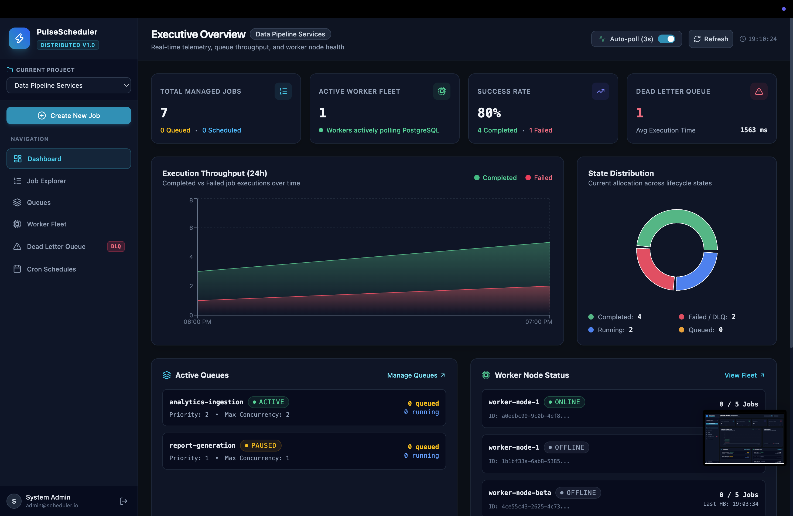

# Distributed Job Scheduler

A production-inspired **Distributed Job Scheduler** built with Node.js, Express.js, PostgreSQL, and React (Vite + Tailwind CSS).

The system demonstrates distributed job processing, atomic concurrency control, retry handling, fault tolerance, worker monitoring, scheduling, and a developer dashboard.

---
## Dashboard Preview

### Developer Dashboard


### Worker Monitoring


### Job Execution


---

## Key Features

### Job Management

- Immediate job submission
- Delayed jobs
- Scheduled jobs
- Batch job submission
- Job status tracking
- Job filtering and pagination
- Job execution history
- Job logs

### Distributed Processing

- Multiple independent worker processes
- Worker-level concurrency limits
- Queue-level concurrency limits
- Atomic job claiming using PostgreSQL transactions
- `FOR UPDATE SKIP LOCKED`
- Priority-based job selection

### Reliability & Fault Tolerance

- Idempotent job submission
- Fixed retry strategy
- Linear retry strategy
- Exponential backoff
- Dead Letter Queue (DLQ)
- DLQ redrive
- Worker heartbeats
- Stale worker detection and recovery
- Graceful worker shutdown

### Scheduling

- Recurring cron schedules
- Automatic generation of scheduled jobs
- Duplicate prevention using schedule state

### Dashboard

- Developer dashboard
- Job Explorer
- Queue management
- Worker fleet monitoring
- DLQ inspection
- Job execution details
- Job logs
- Dashboard statistics

---

## Deliverables

All required assignment deliverables are included in the repository.

| Deliverable | Location |
|---|---|
| Source Code with Setup Instructions | Root project and `README.md` |
| Architecture Diagram | `docs/architecture.md` and `docs/architecture.png` |
| ER Diagram | `docs/database.md` and `docs/er-diagram.png` |
| API Documentation | `docs/api.md` |
| Design Decisions and Trade-offs | `docs/design-decisions.md` |
| Automated Tests | `tests/` and `docs/testing.md` |

---

## Tech Stack

### Backend

- Node.js
- Express.js
- PostgreSQL
- `pg`
- Winston
- Zod
- bcrypt
- JSON Web Token (JWT)

### Worker Service

- Node.js
- PostgreSQL transactions
- Atomic job claiming
- Retry Manager
- Heartbeat Manager
- Stale Worker Recovery
- Cron Scheduler
- Graceful Shutdown

### Frontend

- React
- Vite
- Tailwind CSS
- Axios
- Recharts
- Lucide Icons

### Testing

- Jest
- PostgreSQL integration tests

---

## Project Structure

```text
distributed-job-scheduler/

├── database/
│   ├── migrations/
│   │   └── 001_init_schema.sql
│   ├── seed/
│   │   └── seed.js
│   └── db.js
│
├── server/
│   └── src/
│       ├── controllers/
│       ├── middleware/
│       ├── routes/
│       ├── services/
│       ├── utils/
│       └── server.js
│
├── worker/
│   └── src/
│       ├── worker.js
│       ├── queuePoller.js
│       ├── jobExecutor.js
│       ├── retryManager.js
│       ├── heartbeat.js
│       ├── staleWorkerRecovery.js
│       ├── gracefulShutdown.js
│       └── cronScheduler.js
│
├── client/
│   └── ...
│
├── tests/
│   └── __tests__/
│       ├── auth.test.js
│       ├── backoff.test.js
│       ├── concurrency.test.js
│       ├── dlq.test.js
│       ├── jobs.test.js
│       ├── retry.test.js
│       └── worker.test.js
│
├── docs/
│   ├── architecture.md
│   ├── architecture.png
│   ├── database.md
│   ├── er-diagram.png
│   ├── api.md
│   ├── design-decisions.md
│   └── testing.md
│
├── .env.example
├── package.json
├── package-lock.json
└── README.md
