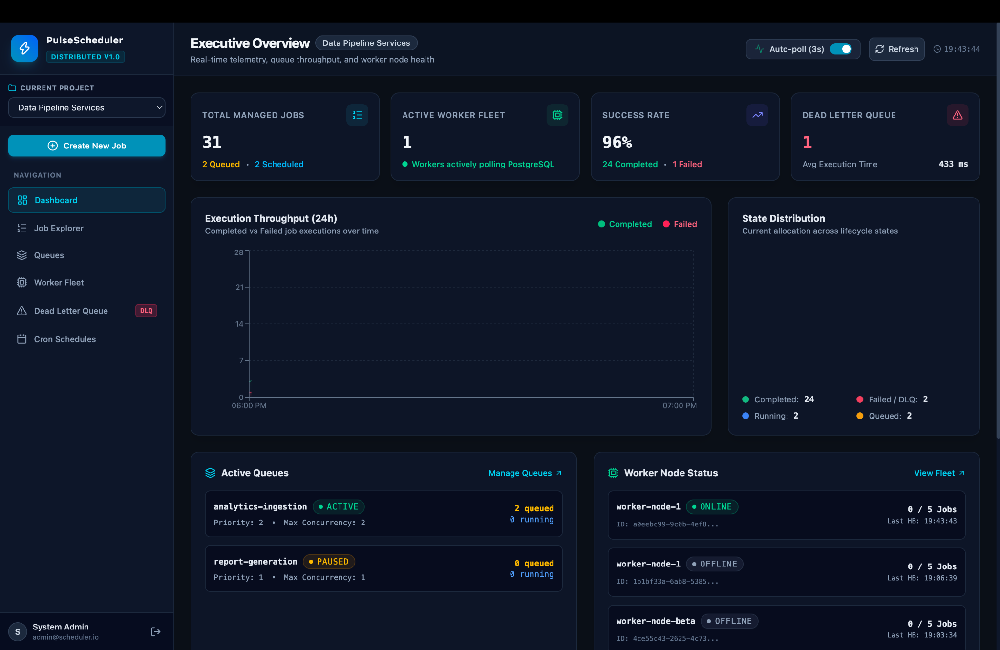
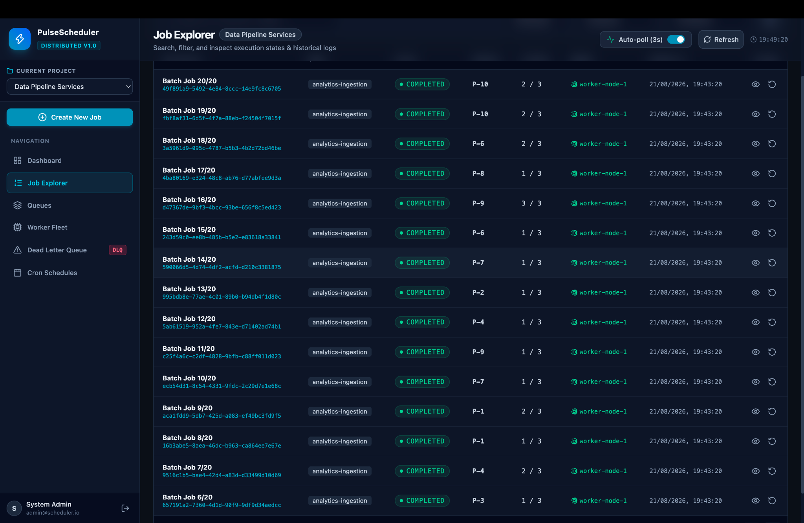
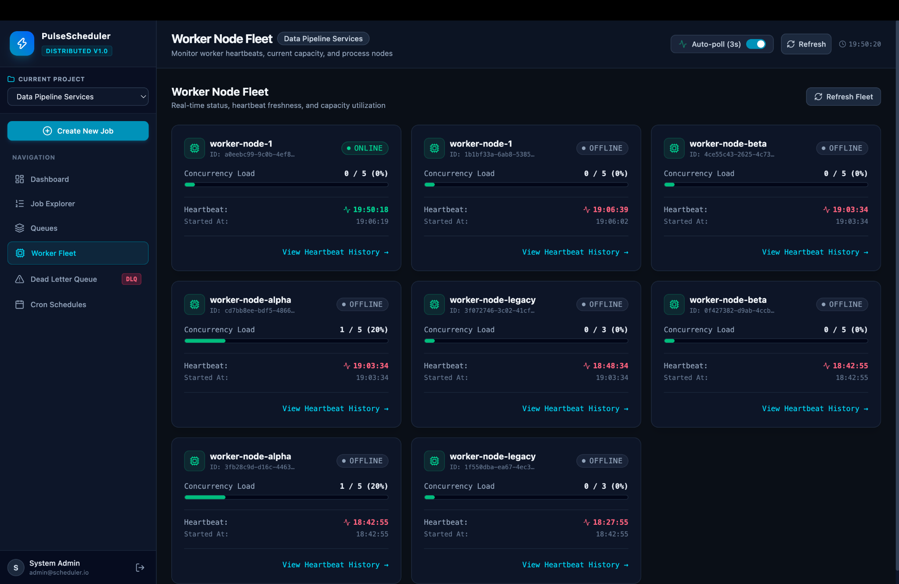
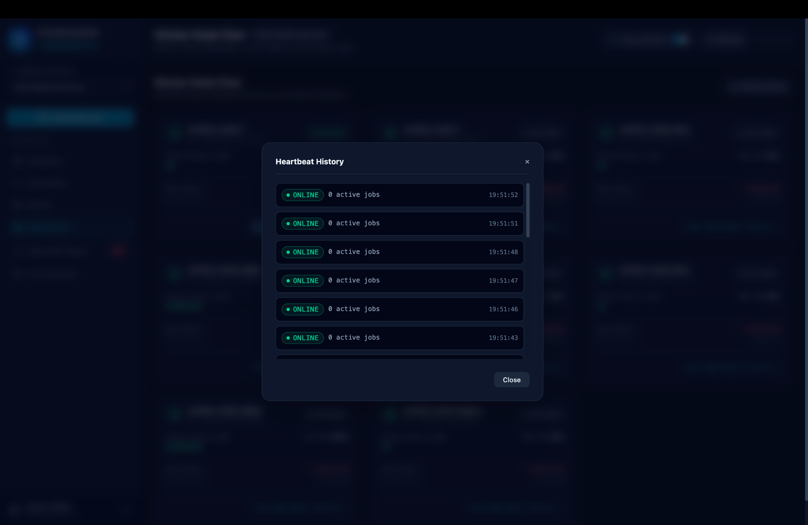
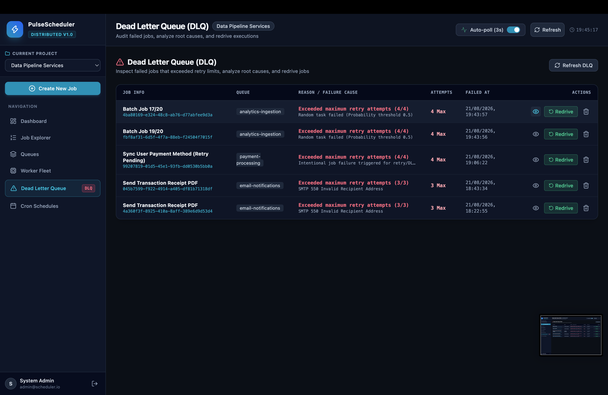
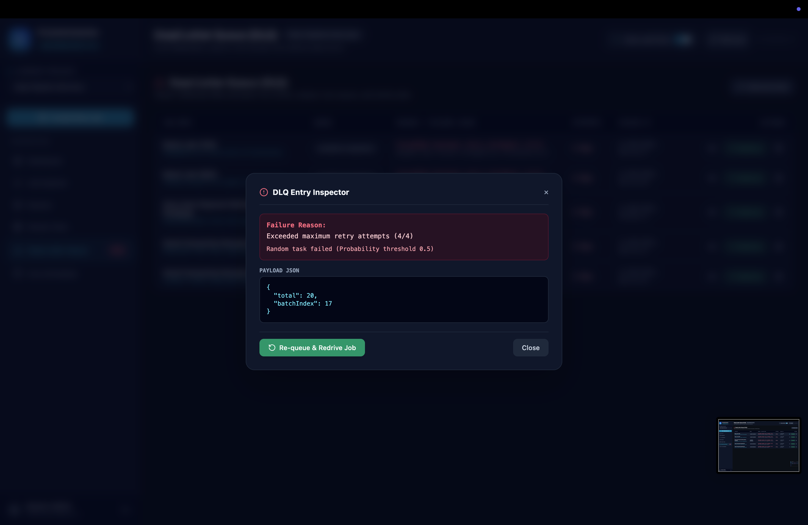
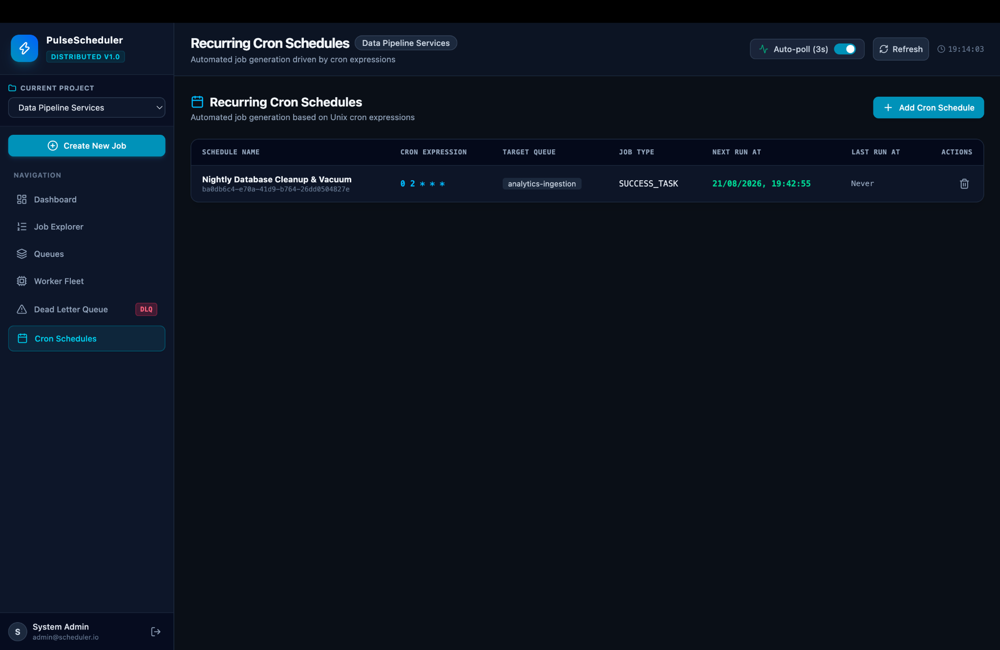

# Distributed Job Scheduler

A production-inspired **Distributed Job Scheduler** built with Node.js, Express.js, PostgreSQL, and React (Vite + Tailwind CSS).

The system demonstrates distributed job processing, atomic concurrency control, retry handling, fault tolerance, worker monitoring, scheduling, and a developer dashboard.

---

## Dashboard & System Monitoring

The platform includes a developer dashboard for real-time visibility into job execution, worker health, queue activity, scheduling, retries, and failed-job recovery.

### Executive Overview

The executive overview provides a consolidated view of managed jobs, worker activity, execution throughput, success rates, queue state, and Dead Letter Queue activity.


### Job Execution Metrics

The dashboard tracks execution throughput, completed and failed jobs, lifecycle-state distribution, queue activity, and worker node status.



### Job Explorer

The Job Explorer provides searchable job visibility with execution status, priority, retry attempts, assigned worker, timestamps, and execution actions.



### Worker Fleet Monitoring

The Worker Fleet view monitors individual worker nodes, online/offline state, concurrency utilization, heartbeat freshness, and worker capacity.



### Worker Heartbeat History

Worker heartbeat history provides visibility into worker liveness and active-job state over time, supporting worker health monitoring and stale-worker detection.



### Dead Letter Queue

The Dead Letter Queue provides visibility into jobs that exceeded their retry limits, including failure causes, attempt counts, timestamps, and redrive actions.



### Dead Letter Queue Inspector

The DLQ inspector provides detailed failure information for individual jobs, including error details, execution payload, and the ability to re-queue failed jobs.



### Recurring Cron Schedules

The scheduling interface manages recurring jobs using Unix cron expressions, target queues, job types, and next/previous execution times.



---

## Key Features

### Job Management

- Immediate job submission
- Delayed jobs
- Scheduled jobs
- Batch job submission
- Job status tracking
- Job filtering and pagination
- Job execution history
- Job logs

### Distributed Processing

- Multiple independent worker processes
- Worker-level concurrency limits
- Queue-level concurrency limits
- Atomic job claiming using PostgreSQL transactions
- `FOR UPDATE SKIP LOCKED`
- Priority-based job selection

### Reliability & Fault Tolerance

- Idempotent job submission
- Fixed retry strategy
- Linear retry strategy
- Exponential backoff
- Dead Letter Queue (DLQ)
- DLQ redrive
- Worker heartbeats
- Stale worker detection and recovery
- Graceful worker shutdown

### Scheduling

- Recurring cron schedules
- Automatic generation of scheduled jobs
- Duplicate prevention using schedule state

### Dashboard

- Developer dashboard
- Job Explorer
- Queue management
- Worker fleet monitoring
- DLQ inspection
- Job execution details
- Job logs
- Dashboard statistics

---

## Deliverables

All required assignment deliverables are included in the repository.

| Deliverable | Location |
|---|---|
| Source Code with Setup Instructions | Root project and `README.md` |
| Architecture Diagram | `docs/architecture.md` and `docs/architecture.png` |
| ER Diagram | `docs/database.md` and `docs/er-diagram.png` |
| API Documentation | `docs/api.md` |
| Design Decisions and Trade-offs | `docs/design-decisions.md` |
| Automated Tests | `tests/` and `docs/testing.md` |

---

## Tech Stack

### Backend

- Node.js
- Express.js
- PostgreSQL
- `pg`
- Winston
- Zod
- bcrypt
- JSON Web Token (JWT)

### Worker Service

- Node.js
- PostgreSQL transactions
- Atomic job claiming
- Retry Manager
- Heartbeat Manager
- Stale Worker Recovery
- Cron Scheduler
- Graceful Shutdown

### Frontend

- React
- Vite
- Tailwind CSS
- Axios
- Recharts
- Lucide Icons

### Testing

- Jest
- PostgreSQL integration tests

---

## Setup & Installation

### Prerequisites

- Node.js
- PostgreSQL
- npm
- Git

### 1. Clone the Repository

```bash
git clone https://github.com/jaschahal211/distributed-job-scheduler.git
cd distributed-job-scheduler
```

### 2. Install Dependencies

```bash
npm install

cd client
npm install
cd ..
```

### 3. Configure Environment Variables

```bash
cp .env.example .env
```

Configure the required PostgreSQL database credentials and application settings in `.env`.

> Never commit the `.env` file. Use `.env.example` as the configuration template.

### 4. Setup PostgreSQL Database

Create the required PostgreSQL database and configure the database connection using the values specified in `.env`.

The repository provides database migrations and seed files under the `database/` directory.

Refer to `docs/database.md` for database schema and configuration details.

### 5. Start the Backend Server

Start the Express.js API server using the appropriate script defined in `package.json`.

### 6. Start Worker Processes

Start one or more worker processes using the appropriate worker script defined in `package.json`.

Multiple worker instances can be started simultaneously to demonstrate:

- Distributed job processing
- Worker-level concurrency
- Queue-level concurrency
- Atomic job claiming
- Retry handling
- Worker heartbeats
- Stale worker recovery
- Fault-tolerant processing

### 7. Start the React Dashboard

```bash
cd client
npm run dev
```

### 8. Run Tests

Run the automated test suite using the test command defined in `package.json`.

Refer to `docs/testing.md` for detailed testing instructions.

---

## Project Structure

```text
distributed-job-scheduler/
│
├── client/
│   └── ...
│
├── database/
│   ├── migrations/
│   │   └── 001_init_schema.sql
│   ├── seed/
│   │   └── seed.js
│   └── db.js
│
├── docs/
│   ├── screenshots/
│   │   ├── dashboard.png
│   │   ├── dashboard-metrics.png
│   │   ├── job-explorer.png
│   │   ├── worker-fleet.png
│   │   ├── worker-heartbeat-history.png
│   │   ├── dead-letter-queue.png
│   │   ├── dead-letter-queue-inspector.png
│   │   └── cron-schedules.png
│   │
│   ├── architecture.md
│   ├── architecture.png
│   ├── database.md
│   ├── er-diagram.png
│   ├── api.md
│   ├── design-decisions.md
│   └── testing.md
│
├── server/
│   └── src/
│       ├── controllers/
│       ├── middleware/
│       ├── routes/
│       ├── services/
│       ├── utils/
│       └── server.js
│
├── tests/
│   └── __tests__/
│       ├── auth.test.js
│       ├── backoff.test.js
│       ├── concurrency.test.js
│       ├── dlq.test.js
│       ├── jobs.test.js
│       ├── retry.test.js
│       └── worker.test.js
│
├── worker/
│   └── src/
│       ├── worker.js
│       ├── queuePoller.js
│       ├── jobExecutor.js
│       ├── retryManager.js
│       ├── heartbeat.js
│       ├── staleWorkerRecovery.js
│       ├── gracefulShutdown.js
│       └── cronScheduler.js
│
├── .env.example
├── package.json
├── package-lock.json
└── README.md
```

---

## Documentation

Additional technical documentation is available in the `docs/` directory:

- `docs/architecture.md` — System architecture and component interactions
- `docs/architecture.png` — Architecture diagram
- `docs/database.md` — Database schema and design
- `docs/er-diagram.png` — Entity Relationship diagram
- `docs/api.md` — API endpoints and usage
- `docs/design-decisions.md` — Design decisions and trade-offs
- `docs/testing.md` — Automated testing strategy and instructions

---

## Documentation

Additional technical documentation is available in the `docs/` directory:

- `docs/architecture.md` — System architecture and component interactions
- `docs/architecture.png` — Architecture diagram
- `docs/database.md` — Database schema and design
- `docs/er-diagram.png` — Entity Relationship diagram
- `docs/api.md` — API endpoints and usage
- `docs/design-decisions.md` — Design decisions and trade-offs
- `docs/testing.md` — Automated testing strategy and instructions
